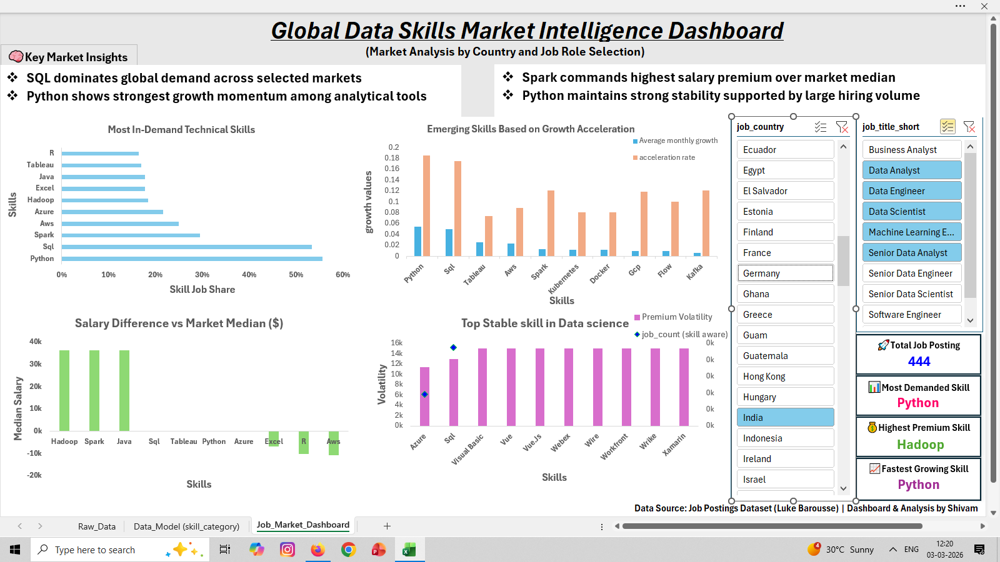
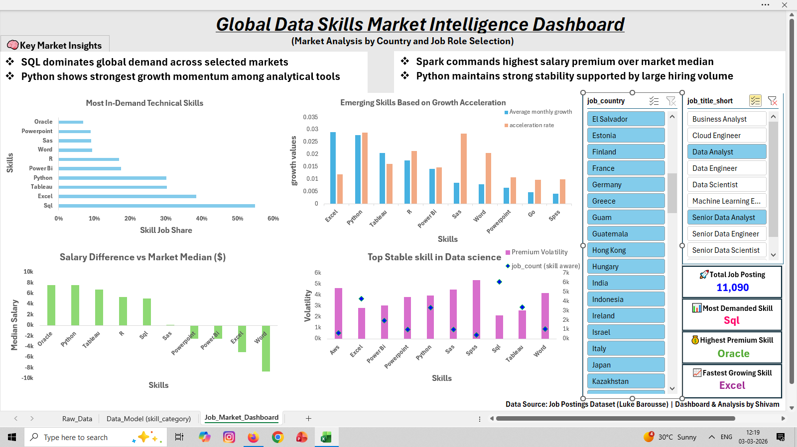
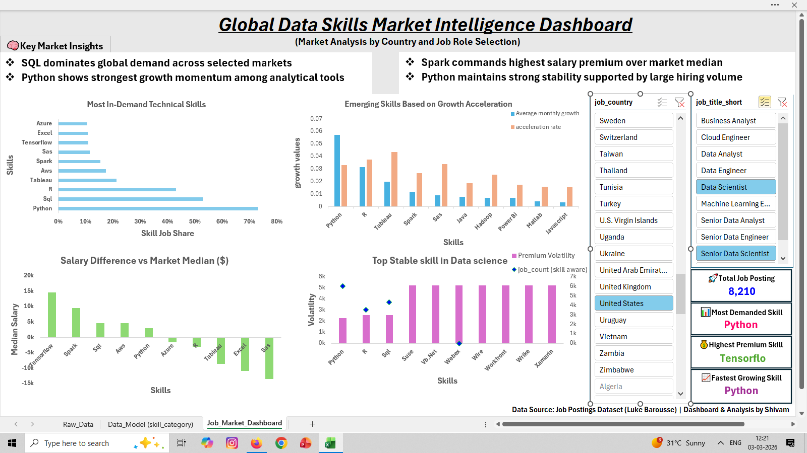

# Excel-global-data-skills-market-intelligence-dashboard


## 📊 Project Overview

This project presents a dynamic Excel dashboard analyzing global data job market trends across 32,000 job postings.  

The objective was to identify high-demand technical skills, evaluate salary premium differentials, measure growth acceleration, and assess market stability across countries and job roles.

The dashboard is fully interactive using dynamic slicers for country and job role selection.

---

## 🎯 Business Questions Addressed

- Which technical skills dominate global hiring demand?
- Which skills command the highest salary premium over market median?
- Which tools demonstrate the strongest growth acceleration?
- Which skills exhibit long-term market stability (low volatility)?
- How do demand and compensation shift across countries and roles?

---

## 🌍Dataset Summary

- Total Job Postings: 32,673 
- Countries Covered: 200+  
- Job Roles: Data Analyst, Data Scientist, Data Engineer, ML Engineer,etc.
- Skills Analyzed: 200+ technical skills

---

## Project Architecture

 Raw Dataset (CSV)
 
      ↓
 Data Cleaning & Skill Categorization
 
      ↓
 Power Pivot Data Model
 
      ↓
 KPI Measure Engineering
 
      ↓
 Interactive Excel Dashboard

---

## 📈 Key Analytical Metrics Built

This project goes beyond simple pivot charts and implements structured analytical logic:

- **Skill Job Share (%)**
- **Salary Premium vs Market Median**
- **Growth Acceleration Rate**
- **Average Monthly Growth**
- **Premium Volatility Index**
- **Stability Index (Demand + Volatility Weighted)**

All metrics were computed using dynamic Excel modeling and conditional logic.

---

## 🛠 Tools & Techniques Used

- Microsoft Excel
- Power pivot
- Power Query
- Data Validation
- Dynamic DAX measures
- Dynamic Array Functions:
  - FILTER()
  - UNIQUE()
  - SORT()
  - XLOOKUP()
  - COUNTIFS()
  - MEDIAN(IF())
- Map Visualization
- Conditional Formatting
- Structured KPI Modeling

---

## 🧠 Analytical Workflow

The workbook is structured into three integrated sheets:

1. **Raw_Data** – Original dataset
2. **Data_Model (Skill Categorization)** – Metric calculations and pivot modeling
3. **Dashboard** – Final interactive visualization layer

This structure demonstrates full data pipeline execution from ingestion to visualization.

---

## 🌍 Dashboard Preview

### Full Dashboard View


### Country-Level Filtering


### Job Role Filtering


### KPI Dynamic Adjustment


---

## 📂 Repository Structure

```
dashboard/        → Final Excel dashboard
data/             → Raw dataset (CSV)
images/           → Dashboard previews
documentation/    → Dataset source information
```

---

## 📊 Dataset Source

Job Postings Dataset by Luke Barousse  
Analysis and dashboard modeling independently performed in Excel.

---

## Key Insights

- SQL dominates global demand across most job markets.  
- Python demonstrates the strongest growth acceleration among analytical tools.  
- Spark commands the highest salary premium relative to market median.  
- Tableau and Power BI show strong adoption in business intelligence roles.

---

## 💡 Project Impact

This dashboard can assist:

- Job seekers in identifying high-value skills
- Professionals in salary negotiation benchmarking
- Analysts studying global skill demand patterns
- Decision-makers tracking market growth signals
- Institute launching emerging skill courses

---

## 👤 Author

Shivam Yadav  
Excel Dashboard Modeling & Market Analysis
